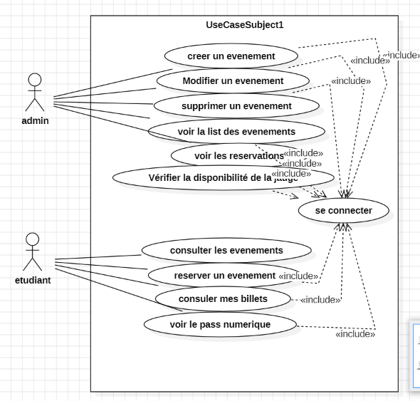

# 🌸 BDE Events — Plateforme de Gestion d'Événements


> Application web moderne et intuitive dédiée à la gestion et la réservation des événements du Bureau des Étudiants (BDE).

---

## ✨ Fonctionnalités Principales

### 🎓 Espace Étudiant
- **Consulter les Événements:** Visualisation en temps réel des événements BDE avec détails (Lieu, Date, Prix, Places restantes).
- **Réservation de Places:** Inscription instantanée aux événements disponibles.
- **Gestion de Billets:** Consultation des billets réservés dans l'espace *Mes Billets*.
- **Annulation:** Possibilité d'annuler une réservation avec remise en stock automatique des places.

### 👑 Espace Admin / BDE
- **Dashboard d'Administration:** Vue d'ensemble sur l'ensemble des événements et le nombre d'inscrits.
- **Gestion CRUD complète:** Création, modification et suppression des événements BDE.
- **Gestion de Jauge Max:** Contrôle dynamique des places disponibles pour éviter la surréservation.

---

## 🎨 Design & Style

L'application bénéficie d'un design **Pastel Minimaliste (Baby Pink & Baby Blue)** conçu avec **Tailwind CSS** :
- Boutons aux coins arrondis (*Pill Style*) avec des dégradés doux.
- Interface épurée avec effet *Backdrop Blur* et cartes fluides.
- Composants responsives adaptés pour mobile et desktop.

---

## 🛠️ Stack Technique

- **Backend:** Laravel (MVC, Eloquent ORM, Blade)
- **Frontend:** HTML5, Tailwind CSS, Blade Templates
- **Base de Données:** MySQL / MariaDB
- **Authentification:** Laravel Auth Middleware

---

## 🚀 Installation & Configuration

Pour exécuter ce projet en local, suivez les étapes ci-dessous :

### 1. Cloner le Projet
```bash
git clone [https://github.com/votre-username/bde-events.git](https://github.com/votre-username/bde-events.git)
cd bde-events

app/
├── Http/
│   ├── Controllers/
│   │   ├── EventController.php
│   │   └── Admin/
│   │       └── EventController.php
│   └── Middleware/
Models/
├── User.php
├── Event.php
└── Reservation.php
resources/
└── views/
    ├── admin/
    │   └── events/ (index, create, edit)
    ├── student/
    │   ├── events/ (index)
    │   └── tickets/ (index)
    └── auth/ (login)



c:\Users\jihan\OneDrive\Images\diagramme de class.png
c:\Users\jihan\OneDrive\Images\ERD.png
auteur : jihane jador;
